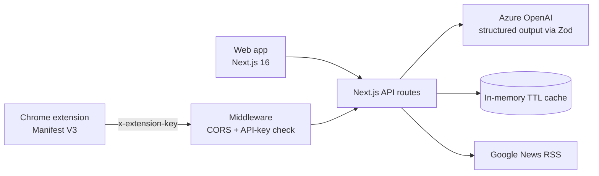

# SidiCyber

> 🏆 **Winner, [HACKATHON NAME] ([MONTH YEAR])**

An AI-powered cyber-awareness platform for Tunisians. It helps people spot the scams they actually receive, such as fake Tunisian Post parcel SMS, bank "account frozen" alerts, STEG bill phishing, and WhatsApp verification-code theft. It explains, in their own language, why a message is dangerous.

Built in 48 hours at [HACKATHON NAME].

**Live demo:** https://sidicyber.salimamri.tech

## Features

- **Scam analyzer.** Paste any suspicious SMS, email or WhatsApp message. The AI returns a 0–100 risk score, the red flags it found, a plain-language explanation and what to do next, tuned to scam patterns common in Tunisia.
- **Browser extension.** A Chrome extension (Manifest V3). Select text on any page, right-click, choose "Analyze with SidiCyber", and get an instant verdict without leaving the page.
- **Scam simulator.** A gamified training mode with realistic Tunisian scam scenarios across SMS, WhatsApp and email. Players decide whether each message is a scam or safe, earn XP, and get an AI breakdown of the psychological tactic used. New scenarios are AI-generated.
- **Cyber-law quiz.** Questions on what Tunisian law says about hacking, account access and online fraud, with explanations and the relevant law.
- **Cyber news.** Tunisian cybersecurity headlines pulled from news feeds in Arabic, French and English, then summarized by AI.
- **Trilingual.** Arabic, French and English, with full right-to-left layout for Arabic.

## Architecture



- **Structured AI output.** Every AI call goes through the Vercel AI SDK's `generateObject` with a Zod schema, so responses are typed and validated, never parsed from free text.
- **Caching.** Generated scenarios (10 minutes) and news summaries (30 minutes) are cached to cut latency and AI cost.
- **Extension security.** Requests from the extension are authenticated with an API key checked in middleware, which also handles CORS preflight.

## Tech stack

- **Frontend:** Next.js 16 (App Router), React 19, Tailwind CSS, Framer Motion
- **AI:** Azure OpenAI through the Vercel AI SDK, with Zod schemas
- **Extension:** Chrome Manifest V3 (service worker, context menus, scripting API)
- **Deployment:** Multi-stage Docker build (Next.js standalone output, non-root user)

## Running locally

```bash
npm install
# create .env.local with the variables below
npm run dev
```

Required environment variables:

| Variable | Purpose |
| --- | --- |
| `AZURE_RESOURCE_NAME` | Azure OpenAI resource name |
| `AZURE_API_KEY` | Azure OpenAI API key |
| `AZURE_DEPLOYMENT_NAME` | Model deployment (defaults to `gpt-4.1-mini`) |
| `EXTENSION_API_KEY` | Shared key the browser extension sends |

**With Docker:**

```bash
docker build -t sidicyber .
docker run -p 3000:3000 --env-file .env.local sidicyber
```

**Loading the extension:** open `chrome://extensions`, enable Developer mode, click "Load unpacked" and select the `extension/` folder. Set `API_URL` and `API_KEY` in `extension/background.js` to match your deployment.

## Team

Built by [Salim Amri](https://github.com/salimamri9) and [@Marvenx](https://github.com/Marvenx).
